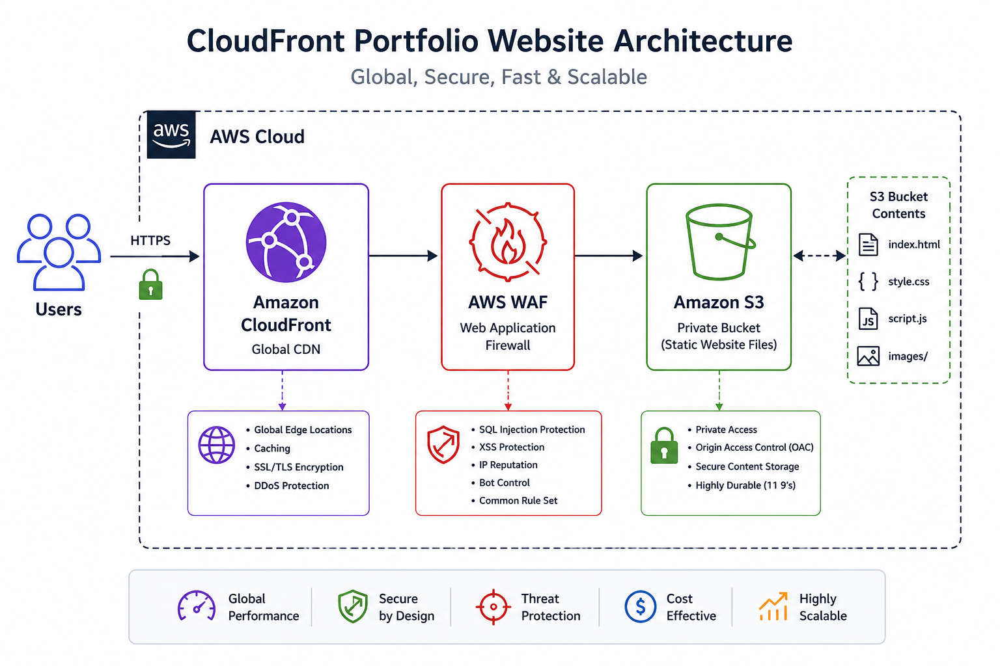

# ☁️ Production-Grade CloudFront Portfolio Website

A modern responsive portfolio website deployed using Amazon CloudFront, Amazon S3, and AWS WAF with secure private bucket architecture and global CDN acceleration.

---

# 🚀 Features

- Global CDN delivery using CloudFront
- Secure private S3 bucket
- HTTPS redirection
- AWS WAF protection
- Responsive modern UI
- Smooth animations
- Cache optimization
- Production-grade deployment architecture

---

# 🏗️ Architecture

```text
Users
   ↓
CloudFront CDN
   ↓
AWS WAF
   ↓
Private S3 Bucket
```

---

# 🛠️ Technologies Used

- HTML5
- CSS3
- JavaScript
- Amazon CloudFront
- Amazon S3
- AWS WAF

---

# 📂 Project Structure

```text
cloudfront-portfolio-website/
│
├── index.html
├── style.css
├── script.js
│
├── images/
│   ├── profile.png
│   ├── background.jpg
│
├── architecture.png
└── README.md
```

---

# 🌍 Deployment Architecture

This project demonstrates a real-world static website hosting architecture using:

- Amazon S3 for object storage
- Amazon CloudFront for global CDN delivery
- AWS WAF for web application protection
- HTTPS secure communication

---

# 🔒 Security Features

- Private S3 bucket access
- Origin Access Control (OAC)
- HTTPS redirection
- AWS WAF protection
- CDN edge security

---

# 📸 Project Preview



---

# 📈 Learning Outcomes

- CDN caching
- CloudFront distributions
- AWS security best practices
- Static website hosting
- Cloud architecture
- Cache invalidation

---

# 👨‍💻 Author

Nitesh Vishwakarma